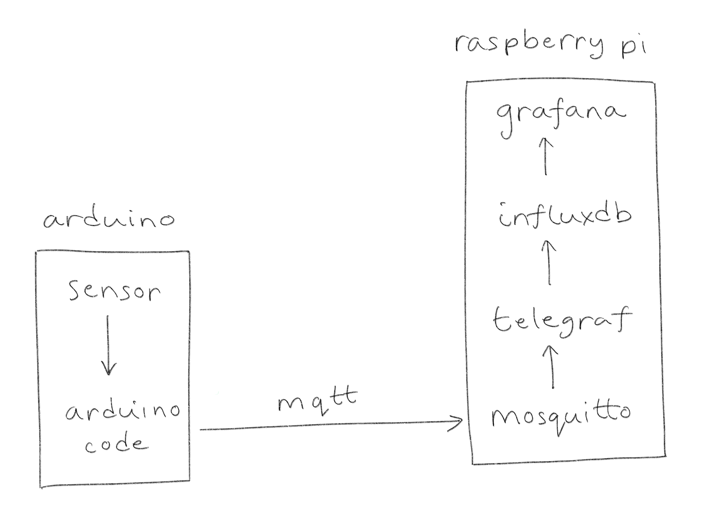
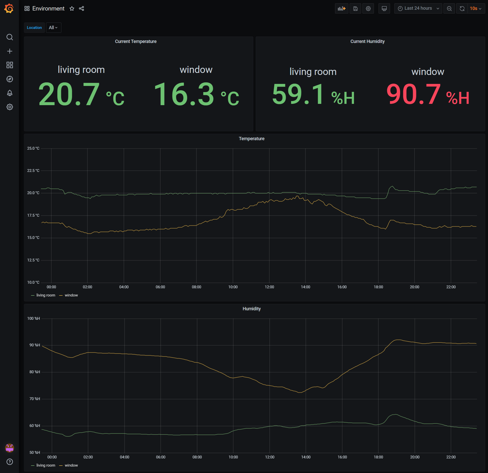

# Introduction
A short time ago in a galaxy not very far away I decided I wanted to know not only the temperature of my surroundings but also how it changed over time. This would be the context for a personal development project which is how I prefer to learn. The basic idea was to measure temperature using a sensor, store the temperature in a database and visualise the temperature with a web application.

This architecture is the end result.

Temperature and humidity are measured using an [AM2320](https://shop.pimoroni.com/products/digital-temperature-and-humidity-sensor) sensor connected to an [Arduino MKR WiFi 1010](https://store.arduino.cc/arduino-mkr-wifi-1010). The Arduino connects to my WiFi and publishes measurements to a [Mosquitto](https://mosquitto.org/) Message Queuing Telemetry Transport (MQTT) broker. A [Telegraf](https://www.influxdata.com/time-series-platform/telegraf/) agent reads measurements from the broker and writes them to an [InfluxDB](https://www.influxdata.com/products/influxdb-overview/) time series database. Measurements are visualised using [Grafana](https://grafana.com/) resulting in a dashboard that looks like this.

&nbsp;

&nbsp;